---

### About Me

Passionate student and aspiring **Data / Business Analyst** & **Product Designer**, with a strong interest in **ML**, **UX**, and **Strategic Thinking**. I enjoy building meaningful projects, creating impactful experiences, and contributing to communities that drive positive change.

---

---

### Skills & Tools

<b>Data & Analytics</b>

 

<b>Machine Learning & AI</b>

 

<b>Design & Product</b>

 

<b>Business & Risk</b>

 

<b>Core CS</b>

 

<b>Web</b>

 

<b>Tools & Platforms</b>

 

---

### GitHub Stats

---

### Connect with Me

)

